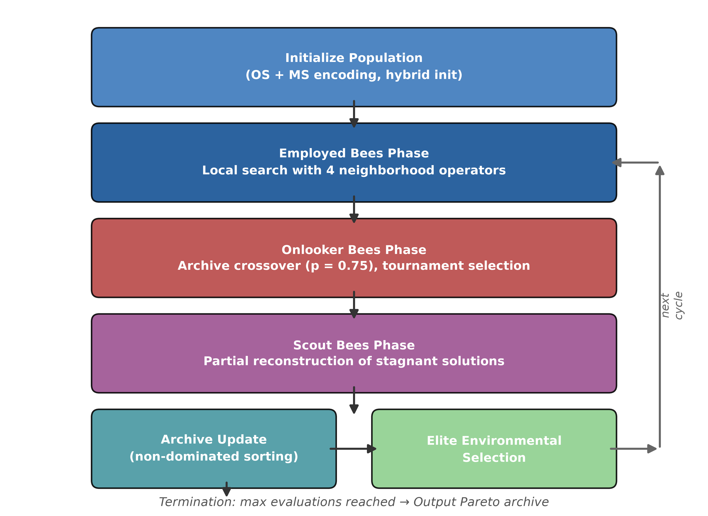
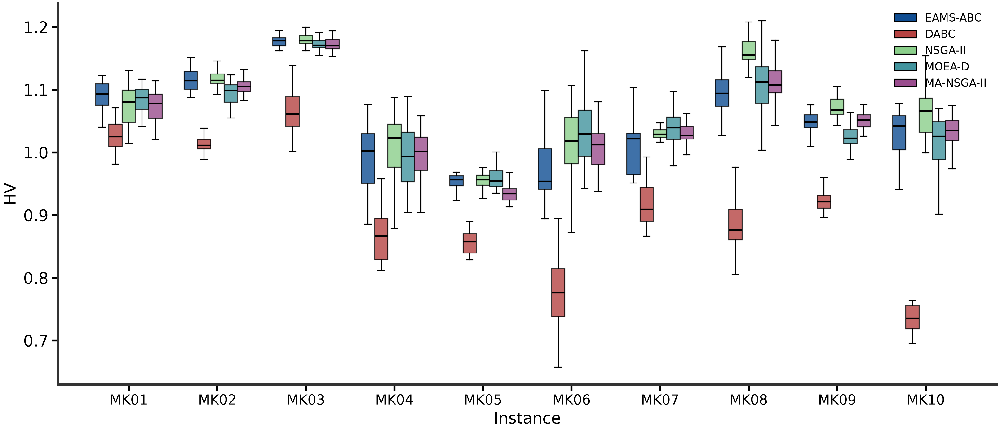
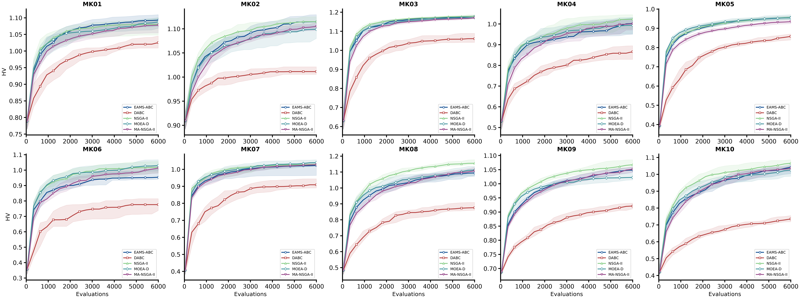
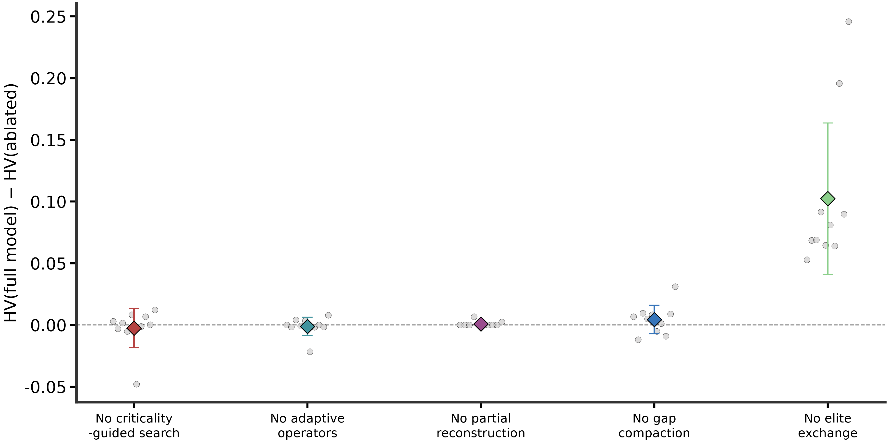
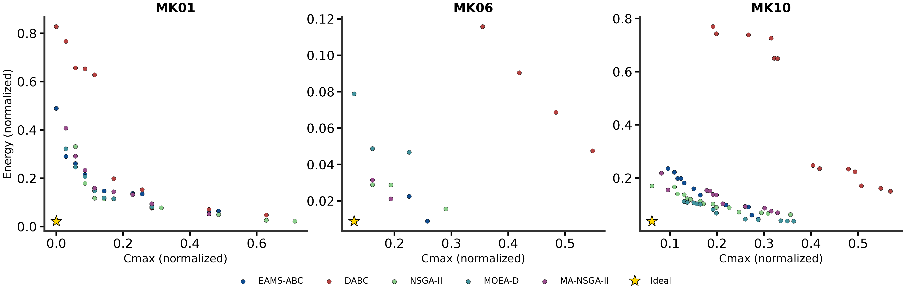
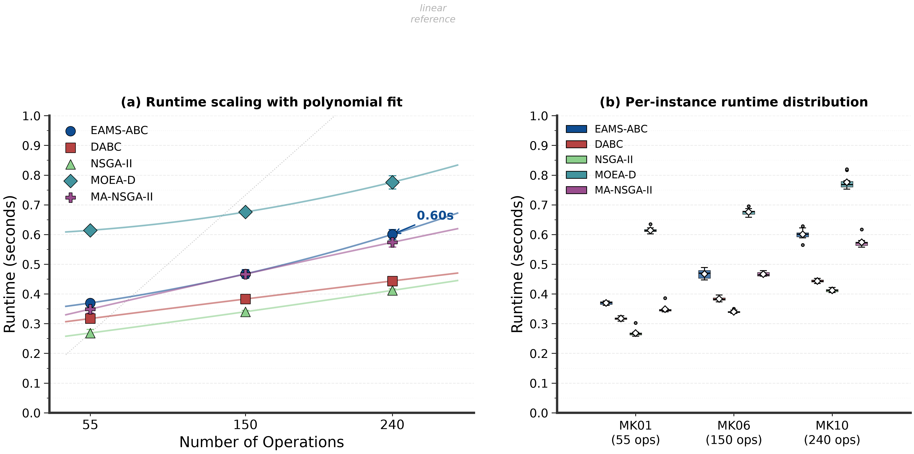

# EAMS-ABC: Energy-Aware Multi-Strategy Artificial Bee Colony with Elite Exchange for Flexible Job Shop Scheduling

[](LICENSE)
[](https://www.python.org/)
[]()

> A bi-objective artificial bee colony algorithm that simultaneously optimizes **makespan** and **total energy consumption** for the flexible job shop scheduling problem (FJSP).

---

## 📌 Overview

EAMS-ABC achieves three coordinated mechanisms within the standard bee colony framework:

1. **Bi-level encoding + reverse compaction decoding** — compresses standby energy without increasing makespan
2. **Joint criticality-driven four-operator neighborhood** — adaptively allocates search budget to high-value operations
3. **Archive crossover + elite environmental selection** — bidirectional information channel between local improvements and population

### Key Results

| Metric | Value |
|--------|-------|
| HV average rank (MK01–MK10) | **2.5** (2nd of 5 methods) |
| Friedman test (main) | **p = 2.7 × 10⁻⁵** |
| HV average rank (MK11–MK15 held-out) | **2.2** (all top-2) |
| Friedman test (held-out) | **p = 0.0013** |
| Ablation: w/o elite exchange | **ΔHV = −0.1024** (Holm p = 0.0098) |
| Total independent runs | 4,560 |
| Total decoding evaluations | 27.36 million |

---

## 📁 Repository Structure

```
git-content/
├── code/
│   ├── core/                  # EAMS-ABC algorithm (9 modules)
│   │   ├── problem.py         # FJSP problem definition + energy model
│   │   ├── decoder.py         # Bi-level encoding + reverse compaction
│   │   ├── initialization.py  # Four-strategy mixed initialization
│   │   ├── criticality.py     # Joint criticality (time + energy + gap)
│   │   ├── operators.py       # Four neighborhood operators + reconstruction
│   │   ├── variation.py       # POX crossover + uniform machine crossover
│   │   ├── pareto.py          # Non-dominated sorting + crowding + archive
│   │   ├── solver.py          # Main ABC loop + config + ablation switches
│   │   └── __init__.py
│   ├── baselines/             # Comparison methods
│   │   ├── nsga2.py           # NSGA-II + MA-NSGA-II variant
│   │   ├── moead.py           # MOEA/D
│   │   ├── genetic.py         # Shared crossover operator
│   │   └── dabc.py            # DABC (configured via solver.Config flags)
│   └── experiments/           # Experiment pipeline
│       ├── run_study.py       # Deterministic parallel runner
│       ├── metrics.py         # HV + IGD+ computation
│       ├── analyze.py         # Statistical analysis (Friedman, Wilcoxon, Holm)
│       ├── check_correctness.py  # Feasibility verification
│       └── generate_figures.py   # All publication figures
├── data/
│   ├── main_results.xlsx      # 8 sheets: HV, IGD+, Ablation, HeldOut, Energy, Timing, Standby, Sensitivity
│   └── run_metrics_raw.csv    # 4,560 rows of raw per-run data
├── datasets/
│   ├── brandimarte/           # 15 MK benchmark instances (MK01–MK15)
│   ├── instances.csv          # Instance metadata
│   ├── power_parameters.csv   # Machine power parameters
│   └── DATASET.md             # Dataset documentation
└── images/                    # 12 publication-quality figures (PNG)
```

---

## 🔬 Algorithm Architecture



### Three Coordinated Mechanisms

| Mechanism | Module | Key Idea |
|-----------|--------|----------|
| **Reverse Compaction** | `decoder.py` | Right-shift operations to close activity windows → reduce standby energy without changing makespan |
| **Joint Criticality** | `criticality.py` | φ(o) = α·CT(o) + (1−α)·[β·CE(o) + (1−β)·GC(o)] — guides neighborhood to critical operations |
| **Elite Exchange** | `solver.py` + `variation.py` | Onlooker archive crossover (p=0.75) + end-of-generation environmental selection |

### Four Neighborhood Operators

| Operator | Action | Target |
|----------|--------|--------|
| N₁ — Critical swap | Swap two operations in OS sequence | Time-critical operations |
| N₂ — Critical insertion | Relocate operation to new position | Time-critical operations |
| N₃ — Machine reassignment | Change machine assignment | Energy-critical operations |
| N₄ — Gap filling | Move operation into idle slot | Gap-correlated operations |

---

## 📊 Results at a Glance

### HV Comparison (MK01–MK10)



### Convergence Curves



### Ablation Study



### Pareto Fronts (MK01 & MK10)



### Runtime Scaling



---

## 🚀 Quick Start

### Prerequisites

```bash
pip install numpy numba scipy matplotlib
```

### Run a Single Instance

```python
from eams_abc.problem import read_problem
from eams_abc.solver import Config, run

p = read_problem('datasets/brandimarte/mk01.txt', scenario='independent', idle_ratio=0.15)
cfg = Config(evaluations=6000, population=40, archive=80)
result = run(p, 'EAMS-ABC', seed=1000, cfg=cfg)
print(f"Makespan={result['cmin']:.1f}, Energy={result['emin']:.1f}")
```

### Reproduce Full Experiments

```bash
cd code/experiments

# Main comparison: 5 methods × 10 instances × 30 runs
python run_study.py --stage main --runs 30 --workers 6

# Ablation: 5 variants × 10 instances × 30 runs
python run_study.py --stage ablation --runs 30 --workers 6

# Held-out validation: 5 methods × 5 instances × 30 runs
python run_study.py --stage heldout --runs 30 --workers 6

# Generate all figures
python generate_figures.py
```

---

## 📈 Experimental Data

All experimental data is provided in `data/main_results.xlsx` (8 sheets):

| Sheet | Content |
|-------|---------|
| HV_Main | Median + mean HV for 5 methods × MK01–MK10 |
| IGD_Plus | Median IGD+ for 5 methods × MK01–MK10 |
| Ablation | Median HV for 5 ablation variants × MK01–MK10 |
| HeldOut_MK11-15 | Median HV for 5 methods × MK11–MK15 |
| Energy_Scenarios | Median HV under speed-dependent power |
| Timing | Mean ± std runtime for 5 methods × 3 instances |
| Standby_Ratio | Median HV under varying standby ratios |
| Sensitivity | Parameter sensitivity (α, ρ, Limit, r) |

Raw per-run data (4,560 rows) is available in `data/run_metrics_raw.csv`.

---

## 📝 Citation

If you use this code or data, please cite:

```bibtex
@article{lu2026eamsabc,
  title={An Energy-Aware Multi-Strategy Artificial Bee Colony Algorithm with Elite Exchange for Flexible Job Shop Scheduling},
  author={Lu, Yong and Zhong, Yaohui},
  journal={Arabian Journal for Science and Engineering},
  year={2026}
}
```

## 📄 License

MIT License — see [LICENSE](LICENSE).

